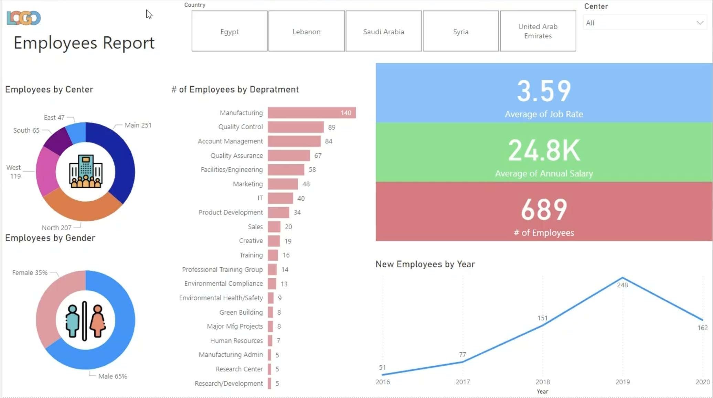

# Employees Demographics Report – Power BI

This Power BI dashboard provides a comprehensive overview of employee demographics across an organization. It highlights gender distribution, departmental spread, geographic location, average salary, and annual hiring trends to support HR analytics and strategic decision-making.

## Dashboard Features

- **Gender Distribution**: Visual breakdown of employees by gender.
- **Location & Department Analysis**: Insights into where employees are located and their respective departments or positions.
- **Hiring Trends**: Tracks the number of new hires per year.
- **Average Salary**: Displays average salary figures across roles or regions.

## Tech Stack

- **Tool**: Power BI
- **Data Source**: HR employee dataset 
- **Visuals Used**:
  - Donut Charts
  - Bar Charts
  - Line Charts
  - KPI Cards

## Insights Gained

- Understand workforce diversity across gender and regions.
- Monitor how hiring has changed over the years.
- Identify average compensation trends across departments or locations.
- Pinpoint departments with the highest/lowest average salaries.

### Screenshot:

- Dashboard by Mariam Raafat
- Created as part of a data visualization learning journey
